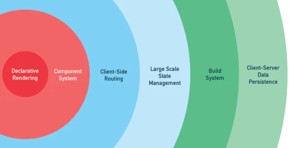

# Outline

## Day 1

1. Intro
1. Vue & Reactivity
1. Vue CLI & Vue Dev Tools
1. Components & Composition
1. Component Lifecycle

## Day 2

1. Working with Remote Data
1. Vue Router
1. Vue Meta
1. State Management with Pinia
1. Composition API
1. Advanced Patterns like Provide Enject, Component Composition
## What we will not  cover

1. Authentication & Authorization
1. Internationalization i18n & localization l10n:
1. Accessibility a11y
1. Vue Plugins & Directives
1. SSR - Server Side Rendering
1. Animation & Transition
1. Data persistence
1. GraphQL & Apollo