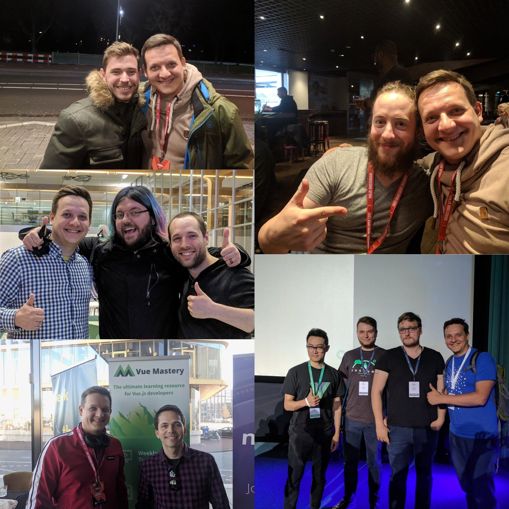

# Intro

## Workshop Author - Aleksej Dix

name: **Aleksej Dix**

Frontend Consultant - [oddEVEN AG](https://oddeven.ch/de/)

twitter: [@aleksejdix](https://twitter.com/@aleksejdix)

## Community / Chat

Webzurich Community: [webzurich](https://webzueri.ch/)

Vue Zürich Meetup: [vue_zurich](https://www.meetup.com/vue_zurich/)

Slack: [Chat](https://webzuerich.slack.com) Channel: [#vue-zurich](https://webzuerich.slack.com/messages/C6618CM9C/)

## Workshop format

You can ask questions any time. Raise your hand or knock on the table.

### How we will work

1. I'll explain
2. You'll ask and you will repeat
3. We'll try it out

<!-- prettier-ignore -->
::: tip
If you are done, help your neighbour
:::

### Feedback

Feedback is welcome

[http://feedback.digicomp.ch](http://feedback.digicomp.ch)
